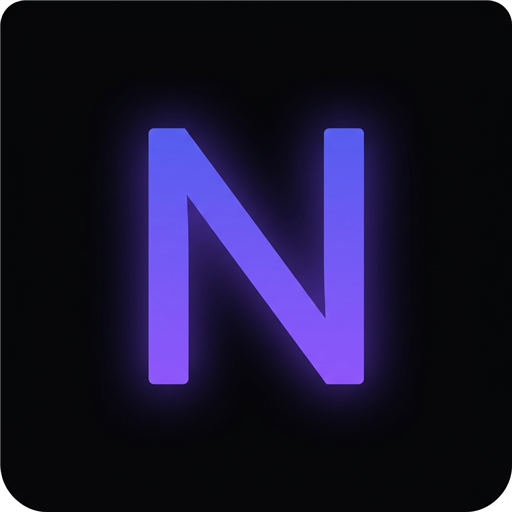
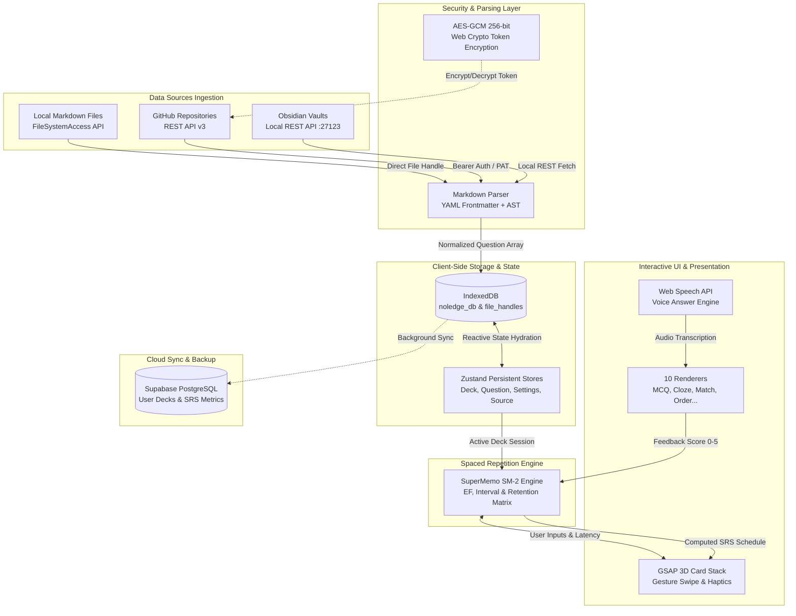

# ⚡ Noledge — Spaced Repetition Revision System

<p align="center">
  
</p>

<p align="center">
  <b>An enterprise-grade, offline-first Progressive Web App (PWA) for intelligent spaced-repetition study, Obsidian vault integration, and GitHub markdown revision decks.</b>
</p>

<p align="center">
  <a href="https://nextjs.org"></a>
  <a href="https://react.dev"></a>
  <a href="https://www.typescriptlang.org"></a>
  <a href="https://vercel.com"></a>
  <a href="https://web.dev/progressive-web-apps/"></a>
</p>

---

## 📌 Executive Summary

**Noledge** transforms static Markdown documentation, Obsidian knowledge vaults, and GitHub repositories into an interactive, high-retention revision platform. Built with **Next.js 16 (App Router)**, **React 19**, **GSAP**, **Zustand**, and **IndexedDB**, it operates 100% offline-first while supporting real-time cloud synchronization.

---

## 🔄 System Architecture & Data Flow

Below is the complete data pipeline from external source ingestion down to storage, spaced repetition calculation, and rendering:



---

## 🛠️ How It Works (Deep Dive)

### 1. Ingestion & Markdown Parsing Pipeline
Noledge reads `.md` files containing structured YAML frontmatter. The custom markdown parser (`src/lib/markdownParser.ts`):
- Extracts metadata (`title`, `type`, `tags`, `difficulty`, `image_url`).
- Validates choices, correct answers, cloze deletions, and pair mappings.
- Normalizes raw markdown into strongly-typed TypeScript `Question` objects.

### 2. SuperMemo SM-2 Spaced Repetition Engine
When a user answers a card, the SM-2 algorithm (`src/engine/srs/sm2.ts`) computes the next review date based on user score ($q \in [0, 5]$):
- **Easiness Factor ($EF$) Calculation**:
  $$EF' = EF + (0.1 - (5 - q) \times (0.08 + (5 - q) \times 0.02))$$
  *(Clamped to a minimum threshold of $1.3$)*
- **Review Interval ($I$) Calculation**:
  - For $n = 1$: $I(1) = 1\text{ day}$
  - For $n = 2$: $I(2) = 6\text{ days}$
  - For $n > 2$: $I(n) = I(n-1) \times EF$

### 3. Security & Token Cryptography
All sensitive tokens (GitHub PATs, Obsidian REST API keys) are protected client-side in `localStorage` via Web Crypto API (`src/utils/crypto.ts`):
- **Algorithm**: **AES-GCM (256-bit)**
- **Key Derivation**: **PBKDF2** with 100,000 iterations of SHA-256 and salt.
- Decryption occurs strictly in-memory during API calls and is never logged or transmitted.

### 4. Client Storage & Performance
- **IndexedDB (`idb`)**: Persists thousands of parsed questions and flashcard decks locally with sub-millisecond retrieval.
- **Zustand Stores**: Manages global UI state, active deck filters, dark mode themes, and audio settings with 0ms reactivity.

---

## 🎯 10 Interactive Question Formats

Noledge supports 10 distinct question modes out of the box:

| # | Format | Code | Description |
|---|---|---|---|
| 1 | **Multiple Choice** | `mcq` | Select one correct answer from options |
| 2 | **Short Answer** | `typing` | Type exact answer string with fuzzy match |
| 3 | **Voice Answer** | `voice` | Speak answer via Web Speech API transcription |
| 4 | **Image Selection** | `image` | Identify & tap correct image grid option |
| 5 | **Fill in the Blank** | `cloze` | Cloze deletion syntax `{{c1::answer}}` |
| 6 | **Ordering** | `ordering` | Drag-and-drop items into correct sequence |
| 7 | **Matching Pairs** | `matching` | Match terms on left with definitions on right |
| 8 | **Flashcard** | `flashcard` | Classic 3D flip card with self-grading |
| 9 | **True / False** | `true_false` | Binary true or false verification |
| 10 | **Multi-Select** | `multiselect` | Select multiple correct checkboxes |

---

## 🚀 Installation & Local Setup

### Prerequisites
- **Node.js**: `v18+` or `v20+`
- **npm** (included with Node.js)
- **Firefox** (Recommended for dev testing)

### Setup Commands

```bash
# Clone the repository
git clone https://github.com/YOUR_USERNAME/noledge.git
cd noledge

# Install dependencies
npm install

# Start the development server
npm run dev
```

Open `http://localhost:3000` in your browser.

---

## 🌐 Free Vercel Hosting Guide

1. Push your repository to **GitHub**.
2. Go to **[Vercel](https://vercel.com)** $\rightarrow$ **Add New Project** $\rightarrow$ Import `noledge`.
3. Configure Environment Variables (copied from `.env.local`):
   - `NEXT_PUBLIC_APP_URL` = `https://your-app.vercel.app`
   - `NEXT_PUBLIC_SUPABASE_URL`
   - `NEXT_PUBLIC_SUPABASE_ANON_KEY`
   - `NEXT_PUBLIC_GITHUB_CLIENT_ID`
   - `GITHUB_CLIENT_SECRET`
4. Click **Deploy**!

---

## 🏗️ Architecture & Directory Map

```
noledge/
├── public/                 # PWA manifest, service worker, & icons
├── questions/              # Local master JSON decks
├── specs/                  # OpenSpec specifications & question format docs
├── src/
│   ├── app/                # Next.js 16 App Router pages & API routes
│   │   ├── api/            # Serverless OAuth, file sync, & Obsidian proxies
│   │   ├── create/         # Deck & Question creator interface
│   │   ├── manage/         # Deck & Question manager dashboard
│   │   ├── settings/       # App settings, themes, & key encryption
│   │   └── study/          # Active SRS Flashcard study session
│   ├── components/         # Design system tokens, FlashCard, CardStack, Sidebar
│   ├── engine/             # SuperMemo SM-2 algorithm & scoring matrix
│   ├── hooks/              # Custom GSAP, swipe, voice, and haptic hooks
│   ├── lib/                # GitHub API, Obsidian client, & Markdown parser
│   ├── stores/             # Zustand persistent state stores
│   ├── types/              # TypeScript schema interfaces
│   └── utils/              # AES-GCM crypto & layout utilities
└── next.config.ts          # Next.js & PWA compiler setup
```

---

<p align="center">
  Crafted with ❤️ for high-retention revision.
</p>
# Noledge
